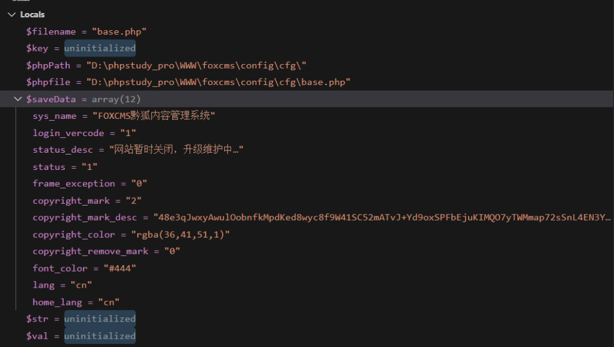
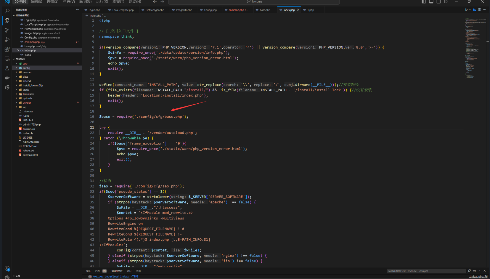
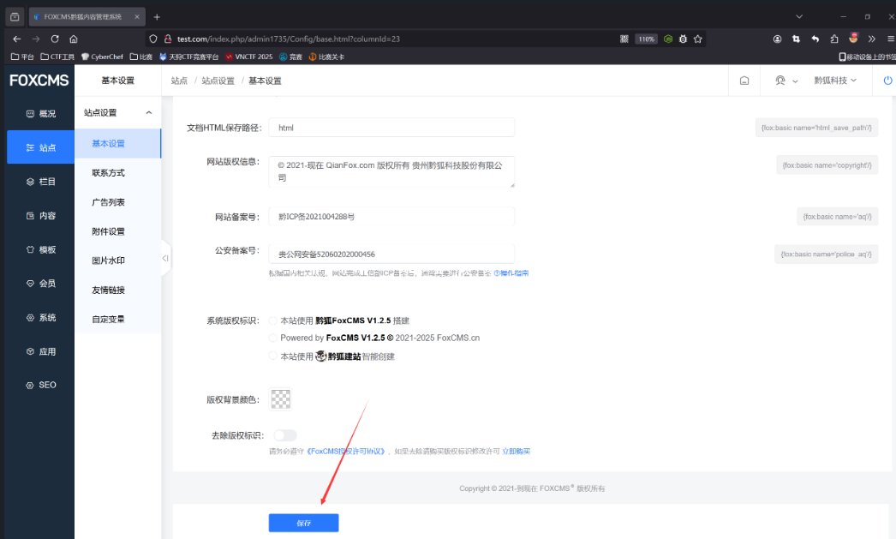
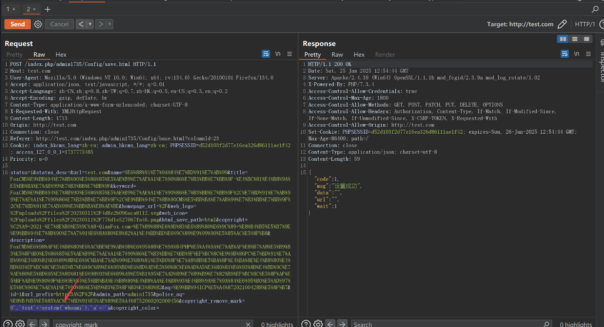
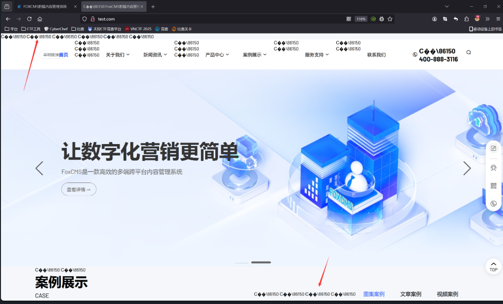

## FoxCMS v1.2.5 Code Injection RCE

The latest version of FoxCMS, v1.2.5, has a command injection vulnerability in the website settings feature due to code concatenation. An attacker can exploit this vulnerability to inject arbitrary PHP code, allowing them to execute commands and gain access to the server.

### Debugging and Analysis

The vulnerability exists in the `save()` function of the controller file `app\admin\controller\Config.php`:
```php
public function save()
{
    $param = $this->request->post();
    $id = $param["id"];
    $base = xn_cfg("base");
    if ($param["status"] != $base["status"]) {
        // Save status
        $base["status"] = $param["status"];
    }
    if ($base["status"] == 0) {
        $base["status_desc"] = $param["status_desc"];
    }
    ......
    if ($base['copyright_remove_mark'] != $param['copyright_remove_mark']) {
        $base['copyright_remove_mark'] = $param['copyright_remove_mark'];
    }

    set_php_arr(config_path('cfg'),  'base.php', $base);
    ......
}
```

The `set_php_arr` function is called to concatenate and write the variable value into a PHP file:
```php
function set_php_arr($phpPath, $filename, $saveData)
{
    // Create directory
    if (!tp_mkdir($phpPath)) {
        return "Failed to create directory";
    }

    $phpfile = $phpPath . $filename;
    $str = "<?php\r\nreturn [\r\n";
    foreach ($saveData as $key => $val) {
        $str .= "\t'$key' => '$val',";
        $str .= "\r\n";
    }
    $str .= '];';
    file_put_contents($phpfile, $str);
}
```

By debugging, we can find the PHP file path being written to and the value of the `saveData` variable. The values in the `param` array are user-controlled, allowing for code injection by concatenating PHP code into the file.

```r
$phpfile = config\cfg\base.php
```


Since the `index.php` file includes `config\cfg\base.php`, the injected code will be executed.



### Exploiting the Vulnerability

To exploit this, go to the site settings page and click "Save," then capture the request.



Modify the `copyright_remove_mark` parameter to the following payload:
```r
0','test'=>system('whoami'),'a'=>'a
```




Afterward, access the homepage (`index.php`) and observe that many areas of the page now display the results of the executed command. Besides the command output, the attacker can also directly reverse shell into the server and gain access to the system.

