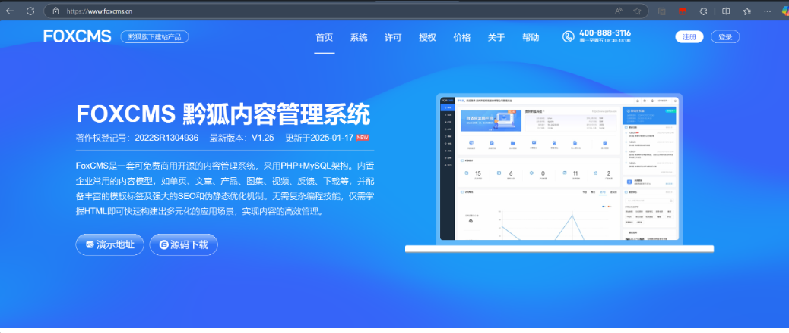

## FoxCMS v1.2.5 XSS Vulnerability

### Vulnerability Description
The latest version of FoxCMS v1.2.5 contains an XSS vulnerability in the Security management functions. This vulnerability arises due to insufficient input validation and sanitization, allowing an attacker to inject arbitrary JavaScript code. The injected code will execute when other users view the file.

FoxCMS is an open-source content management system (CMS) based on PHP+MySQL architecture. It includes common content models like single pages, articles, products, galleries, videos, feedback, downloads, etc. It also features rich template tags, SEO optimization, and static URL support. No advanced programming skills are needed, and it allows for quick building of diverse applications for efficient content management. The system supports multi-language support, form design, visitor statistics, message notifications, cloud storage services, etc.

Project Source Code: [Gitee FoxCMS](https://gitee.com/qianfox/foxcms)  
Official Website: [FoxCMS](https://www.foxcms.cn/)



### White-box Audit
The vulnerable code is in `app\admin\controller\Safe.php`
```php
    public function saveBlack(){
        // Query blacklist IPs
        $param = $this->request->post();
        if(!array_key_exists("blacklists", $param)){
            $this->error("Blacklist data does not exist");
            if(empty(trim($param['blacklists']))){
                $this->error("Blacklist data cannot be empty");
            }
        }
        $blacklist = explode("\n", trim($param['blacklists']));
        $blacklistList = Blacklist::select();
        $saveBlacklist = [];
        foreach ($blacklist as $key=>$ip){
            $isExist = false;
            foreach ($blacklistList as $black){
                if($ip == $black['ip']){
                    $isExist = true;
                }
            }
            if(!$isExist){
                array_push($saveBlacklist, ['ip'=>$ip, "create_time"=>date("Y-m-d H:i:s", time()), 'update_time'=>date("Y-m-d H:i:s", time())]);
            }
        }
        if(sizeof($saveBlacklist) > 0){
            $rblack = (new Blacklist())->saveAll($saveBlacklist);
            if(sizeof($rblack) <= 0){
                $this->error('Save failed');
            }
            $this->success('Save successful');
        }else{
            $this->error("IP already exists in the blacklist");
        }
    }
```

During debugging, it was found that the input IP parameters are not filtered and are directly passed to `saveAll` for storage.


When accessing the query, debugging eventually led to HTML being inserted directly into the page, causing the XSS vulnerability.


### Vulnerability Exploitation

When adding an IP to the blacklist in the backend system's security management, an attacker can insert the following payload:
```html
<script>alert(/xss/)</script>
```


When the security management feature is clicked, the XSS payload is triggered.

