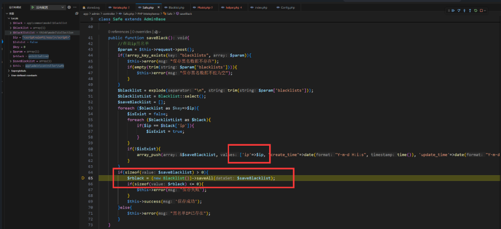
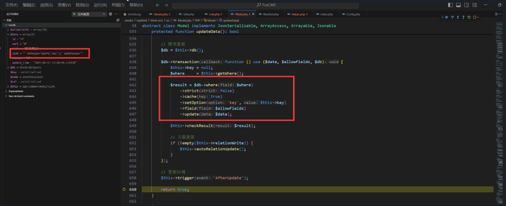
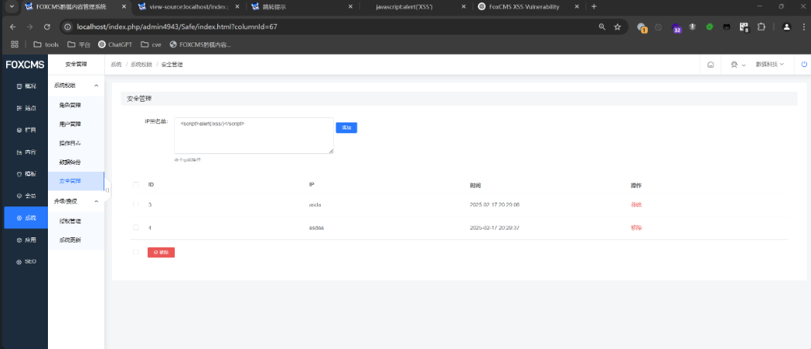
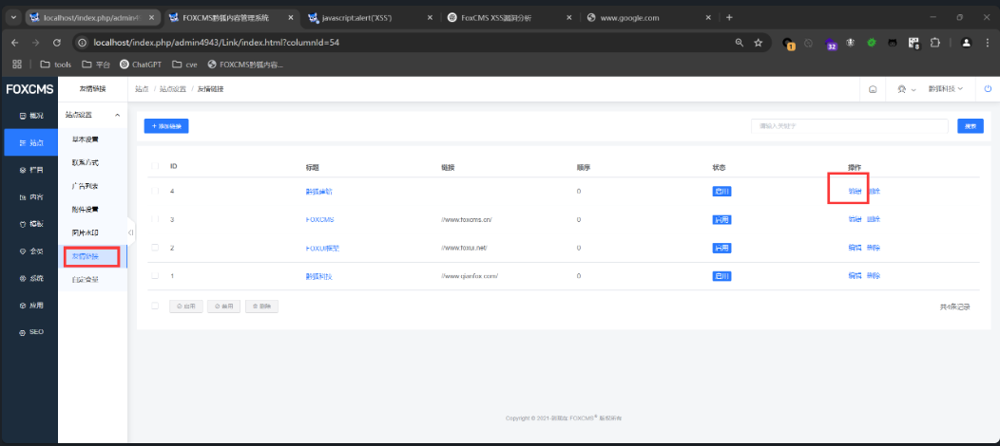

## FoxCMS v1.2.5 XSS Vulnerability

### Vulnerability Description
The latest version of FoxCMS v1.2.5 contains an XSS vulnerability in the Security management functions. This vulnerability arises due to insufficient input validation and sanitization, allowing an attacker to inject arbitrary JavaScript code. The injected code will execute when other users view the file.

FoxCMS is an open-source content management system (CMS) based on PHP+MySQL architecture. It includes common content models like single pages, articles, products, galleries, videos, feedback, downloads, etc. It also features rich template tags, SEO optimization, and static URL support. No advanced programming skills are needed, and it allows for quick building of diverse applications for efficient content management. The system supports multi-language support, form design, visitor statistics, message notifications, cloud storage services, etc.

Project Source Code: [Gitee FoxCMS](https://gitee.com/qianfox/foxcms)  
Official Website: [FoxCMS](https://www.foxcms.cn/)


### White-box Audit
The vulnerable code is in `app\admin\controller\Safe.php`:
```php
    public function saveBlack(){
        // Query IP blacklist
        $param = $this->request->post();
        if(!array_key_exists("blacklists", $param)){
            $this->error("The blacklist data does not exist");
            if(empty(trim($param['blacklists']))){
                $this->error("The blacklist data cannot be empty");
            }
        }
        $blacklist = explode("\n", trim($param['blacklists']));
        $blacklistList = Blacklist::select();
        $saveBlacklist = [];
        foreach ($blacklist as $key=>$ip){
            $isExist = false;
            foreach ($blacklistList as $black){
                if($ip == $black['ip']){
                    $isExist = true;
                }
            }
            if(!$isExist){
                array_push($saveBlacklist, ['ip'=>$ip, "create_time"=>date("Y-m-d H:i:s", time()), 'update_time'=>date("Y-m-d H:i:s", time())]);
            }
        }
        if(sizeof($saveBlacklist) > 0){
            $rblack = (new Blacklist())->saveAll($saveBlacklist);
            if(sizeof($rblack) <= 0){
                $this->error('Save failed');
            }
            $this->success('Save successful');
        }else{
            $this->error("Blacklist IP already exists");
        }
    }
```

Debugging revealed that the input IP parameter is not filtered and is directly used in the `saveAll` storage call.


When accessing the query, debugging finally reaches the HTML, where it is directly inserted into the page, causing an XSS vulnerability.


### Vulnerability Exploit

In the backend system's security management, add the following IP blacklist with the payload:
```html
<script>alert(/xss/)</script>
```


Then, clicking on the security management function triggers the XSS popup.
