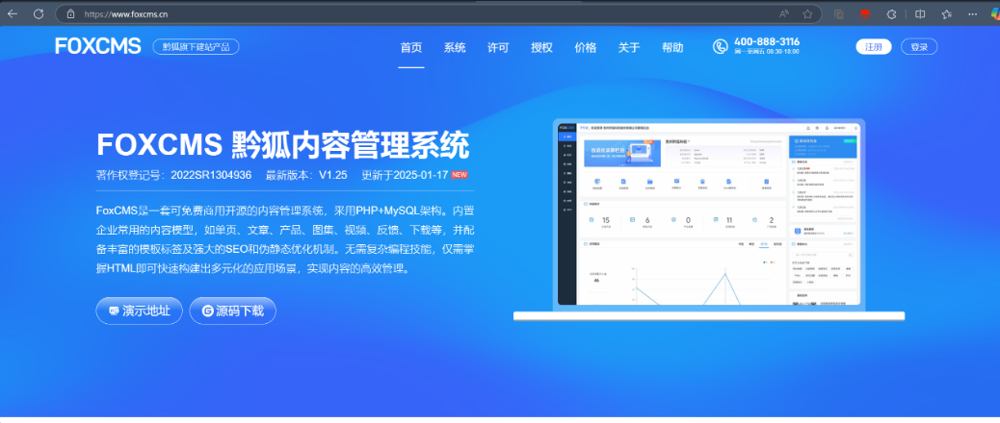
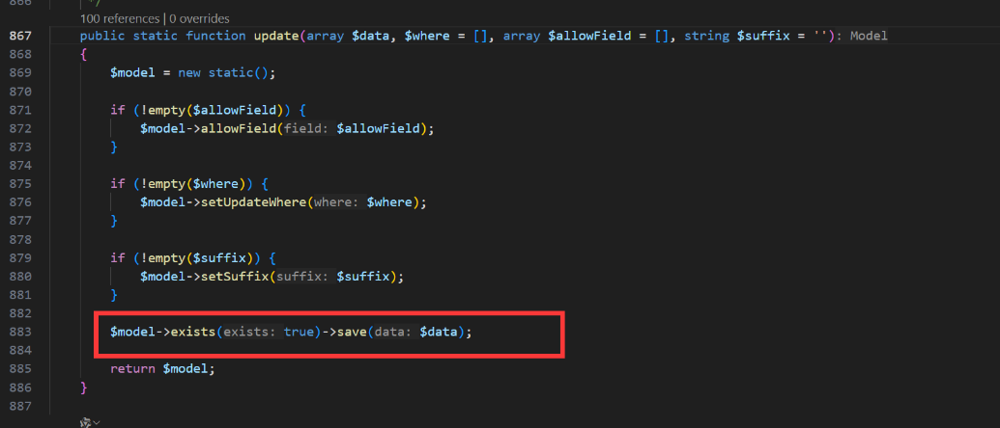
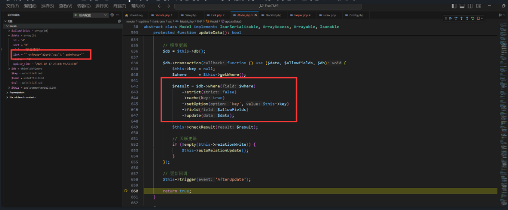
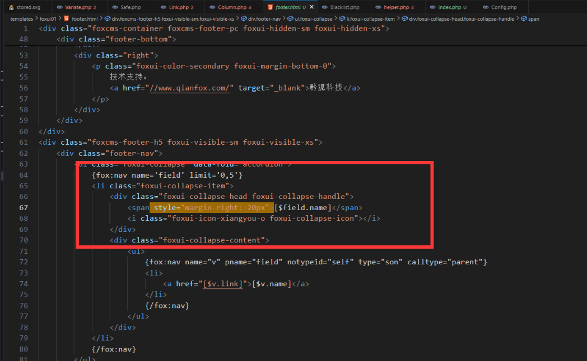
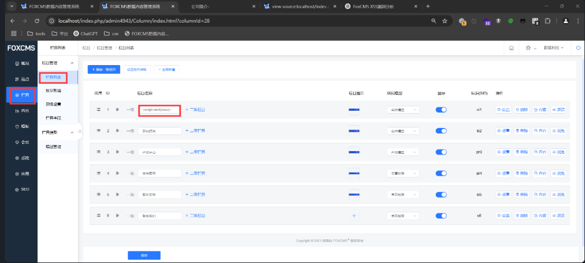
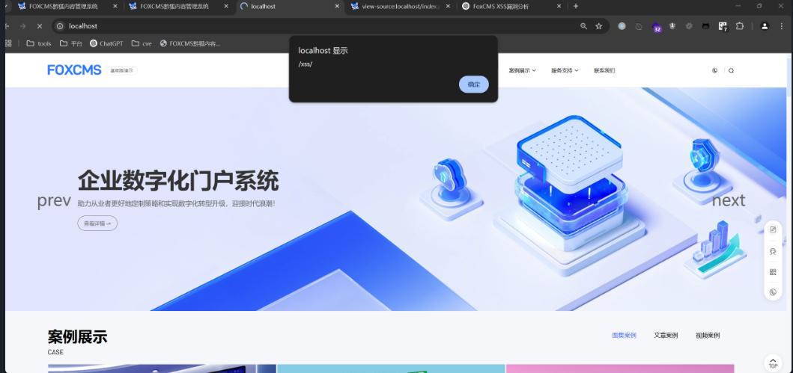

## XSS Vulnerability in FoxCMS v1.2.5
### Vulnerability Description
The latest version of FoxCMS v1.2.5 contains an XSS vulnerability in the Website homepage link. This vulnerability arises due to insufficient input validation and sanitization, allowing an attacker to inject arbitrary JavaScript code. The injected code will execute when other users view the file.

FoxCMS is an open-source, free-to-use content management system (CMS) based on PHP+MySQL architecture. It includes commonly used content models such as single pages, articles, products, galleries, videos, feedback, downloads, etc., and comes with rich template tags, SEO optimization, and static URL features. No advanced programming skills are needed, and users only need to know HTML to quickly build diverse applications for efficient content management. The system also supports multi-language support, form design, visitor statistics, message notifications, cloud storage services, etc.

Project Source Code: [Gitee FoxCMS](https://gitee.com/qianfox/foxcms)  
Official Website: [FoxCMS](https://www.foxcms.cn/)


### White-box Audit

In auditing the vulnerable file `app\admin\controller\Column.php`, it was found that the following code is used:
```php
   // Column settings
    public function columnSet()
    {
        $param = $this->request->param();
        // Query
        $lang = xn_cfg("base.lang");

        $bcid = $param['bcid'];
        View::assign('bcid', $bcid);
        $ids = explode('_', $bcid);
        $authRuleId = $ids[sizeof($ids) - 1]; // Column ID
        $authRule = AuthRule::find($authRuleId);
        $bcidStr = str_replace(",", "_", $authRule->tier);
        $breadcrumb = AuthRule::getBreadcrumb($bcidStr);
        array_push($breadcrumb, ['id' => '', 'title' => 'Column Settings', 'name' => DIRECTORY_SEPARATOR . config('adminconfig.admin_path') . '/column/columnSet', 'url' => 'javascript:void(0)']);
        View::assign("breadcrumb", $breadcrumb);

        if (empty($param['id'])) {
            $this->error('Column ID parameter cannot be empty');
        }
        $id = $param['id'];
        View::assign('id', $id);
        if ($this->request->isAjax()) {
            $oldColumnModel = ColumnModel::find($param["id"]);
            //            if($oldColumnModel['nid'] != $param['nid']){
            //                // Check if the identifier exists for the current language
            //                $fList = ColumnModel::where([['lang','=', $lang],['nid','=',$param['nid']]])->select();
            //                if(sizeof($fList) > 0){
            //                    $this->error("Identifier already exists for the current language");
            //                }
            //            }
            if (!empty($param['dir_path'])) {
                $param['dir_path'] =  add_slash($param['dir_path']);
            } else {
                $en_name = implode("", PinyinUtil::utf8_to($param["name"])); // Column pinyin
                $param['dir_path'] = add_slash($en_name);
            }
            if ($oldColumnModel["column_model"] != $param["column_model"]) {
                $v_path = $this->getVPath($param["column_model"]);
                $param['v_path'] = $v_path;
            }

            $ret = ColumnModel::update($param);
            if ($ret) {
                // Modify its child columns model
                $inherit_option = intval($param['inherit_option']);
                // Bulk modify inherited option columns
                try {
                    if ($inherit_option == 1) { // Inherit template style 0: don't inherit; 1: inherit
                        $sql = "update fox_column set column_template = '{$param['column_template']}',model_template = '{$param['model_template']}' where FIND_IN_SET({$param['id']}, tier)>0 and id != {$param['id']} and column_model = '{$param['column_model']}'";
                        Db::execute($sql);
                    }
                } catch (\Exception $e) {
                    $e->getMessage();
                }
                $this->success('Operation successful');
            } else {
                $this->error("Operation failed");
            }
        }
        $column = ColumnModel::find($id);
        $iew_suffix = config('view.view_suffix');

        if (empty($column->column_template)) { // Column model file name
            $mr = \app\common\model\ModelRecord::where('nid', $column->column_model)->find();
            if ($mr && $mr['reference_model'] == 0) {
                $column["column_template"] = "list_" . $column->column_model . ".{$iew_suffix}";
                $column["model_template"] = "view_" . $column->column_model . ".{$iew_suffix}";
            } else {
                $column["column_template"] = "index_" . $column->column_model . ".{$iew_suffix}";
            }
        }
        // Model
        $modelTitle = '';
        foreach ($this->modelRecords as $k => $vo) {
            if ($vo['id'] == $column->column_model) {
                $modelTitle = $vo['title'];
                break;
            }
        }
        View::assign('model', '/home/');
        // Query all columns
        $columnList = \app\common\model\Column::where([['level', '<=', 3], ['lang', '=', $this->getMyLang()]])->order('level asc')->select();
        $columns = [['name' => 'Top-level column', 'id' => 0, "pid" => 0]];
        foreach ($columnList as $k => $cm) {
            array_push($columns, ["name" => $cm["name"], "id" => $cm["id"]]);
            if (empty($column['innerColumnText']) && !empty($column['inner_column']) && ($column['inner_column'] == $cm["id"])) {
                $column['innerColumnText'] = $cm["name"];
            }
        }
        $columnListC = $this->channelLevel($columnList);
        View::assign('columnListC', $columnListC);

        $column["modelTitle"] = $modelTitle; // Model
        // Whether to display column data
        $columnCount = \app\common\model\Column::where("pid", $id)->count();
        View::assign('columnCount', $columnCount);
        if ($columnCount > 0) { // Query this column and specified sub-columns
            $rColumnList = get_column_down($id, $column["column_model"]);
            $limit_column = $column["limit_column"];
            $limitColumnTextArr = []; // Limited columns
            if (!empty($limit_column)) {
                $limitColumnIdArr = explode(",", $limit_column);
                foreach ($limitColumnIdArr as $limitColumnId) {
                    foreach ($rColumnList as $rColumn) {
                        if ($limitColumnId == $rColumn["id"]) {
                            array_push($limitColumnTextArr, $rColumn['name']);
                            $rColumn["is_active"] = "is-active";
                            break;
                        }
                    }
                }
                View::assign('limitColumnIdArr', $limitColumnIdArr);
            }
            View::assign('rColumnList', $rColumnList);

            View::assign('limitColumnText', implode(",", $limitColumnTextArr));
        }
        // Special models
        if (!empty($column['form_list_id'])) { // Application form ID
            $formL = \app\common\model\FormList::field("name")->find($column['form_list_id']);
            if ($formL) {
                $column['formTitle'] = $formL['name'];
            }
        }
        // Form URL
        $apply = \app\common\model\Apply::where(['status' => 1, 'name' => 'Custom Form'])->find();
        $formUrl = url("Apply/index") . "?columnId=42&type=1";
        if ($apply) {
            if (!empty($apply["path"])) {
                $path = $apply['mark'] . $apply["path"];
                $url = url($path) . "?columnId=" . $apply['column_id'];
                if (!empty($apply['auth_rule_ids'])) {
                    $url = $url . "&ruleIds=" . $apply['auth_rule_ids'];
                }
                $formUrl = $url . "&type=1";
            }
        }
        $column['formUrl'] = $formUrl;

        $ocList = \app\common\model\Column::where([['lang', '<>', $lang], ['column_model', '=', $column['column_model']]])->order('level asc')->order('sort asc')->select();
        $ocList = $this->channelLevel($ocList);
        View::assign('ocList', $ocList);

        return view('column_set', ['column' => $column, 'columns' => $columns, "activepath" => $this->relativeTemplateHtml]);
    }
```
In the source code, we can see that the parameter data is directly passed to the model's `update` function:
```r
$ret = ColumnModel::update($param);
```


Continuing the investigation, we found that the `data` is passed into the `save` function:



The `save` function then calls `updateData()` to perform the update:

```php
 public function save(array $data = [], string $sequence = null): bool
    {
        // Assign data to object
        $this->setAttrs($data);

        if ($this->isEmpty() || false === $this->trigger('BeforeWrite')) {
            return false;
        }

        $result = $this->exists ? $this->updateData() : $this->insertData($sequence);

        if (false === $result) {
            return false;
        }

        // After-write callback
        $this->trigger('AfterWrite');

        // Re-record original data
        $this->origin   = $this->data;
        $this->get      = [];
        $this->lazySave = false;

        return true;
    }
```

Ultimately, the SQL query executes to insert data without filtering.




When the website homepage is accessed, the `templates\foxui01\footer.html` template is rendered, and the value is directly inserted into the HTML, resulting in an XSS vulnerability.




### Vulnerability Exploit

In the website backend, modify the column name to the following payload:

```html
<script>alert(/xss/)</script>
```



Then visit the website homepage, and the XSS vulnerability will be triggered:

```r
http://localhost/
```


